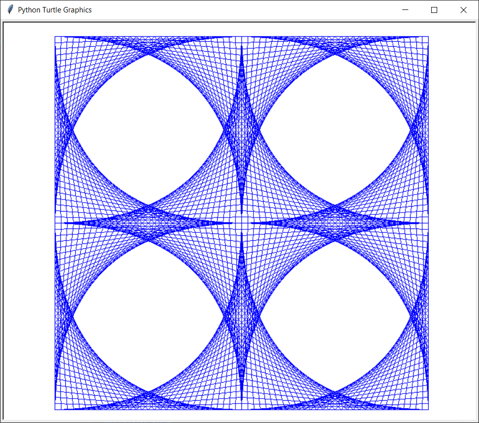
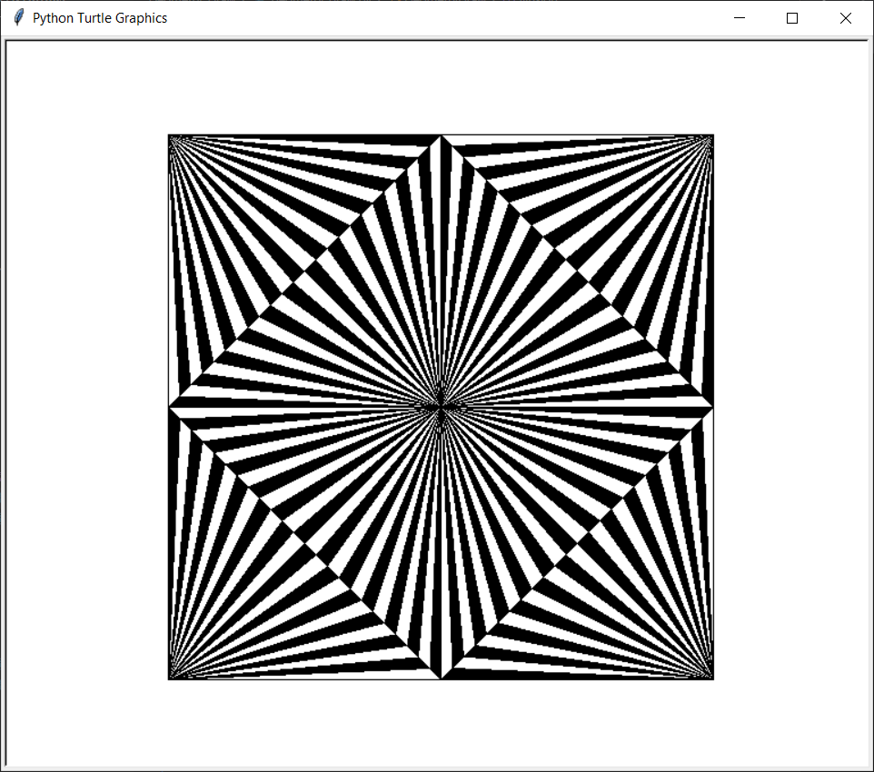
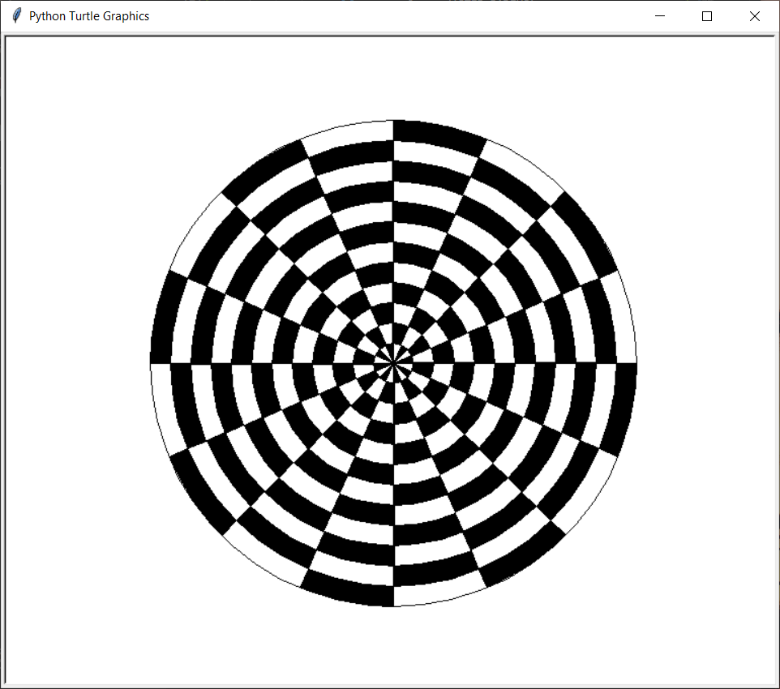
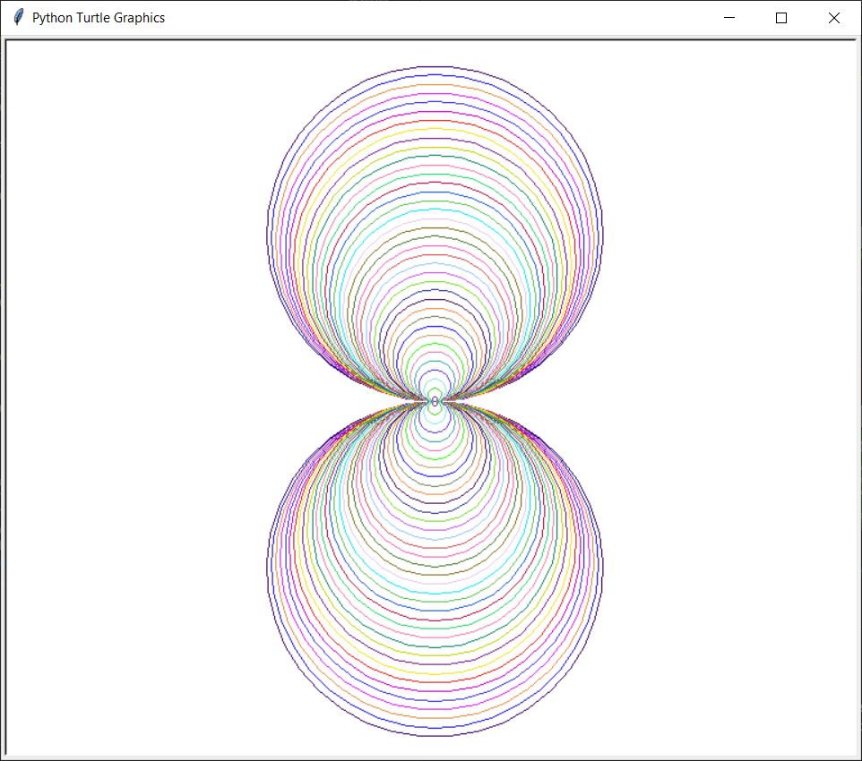
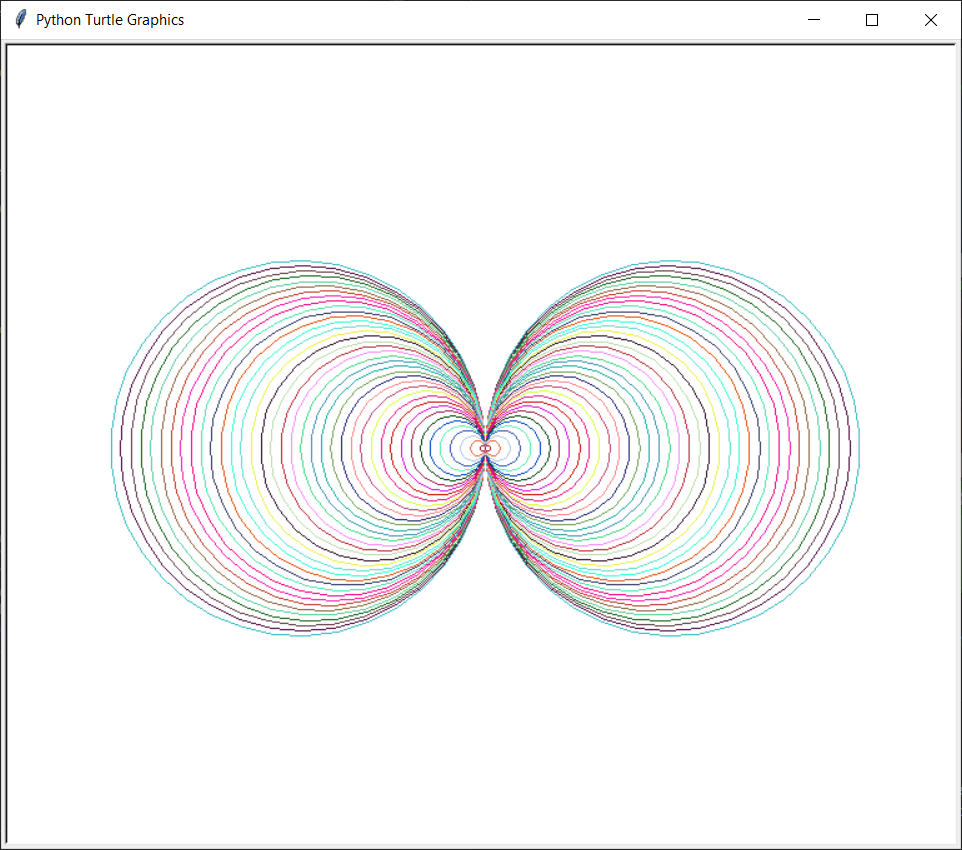
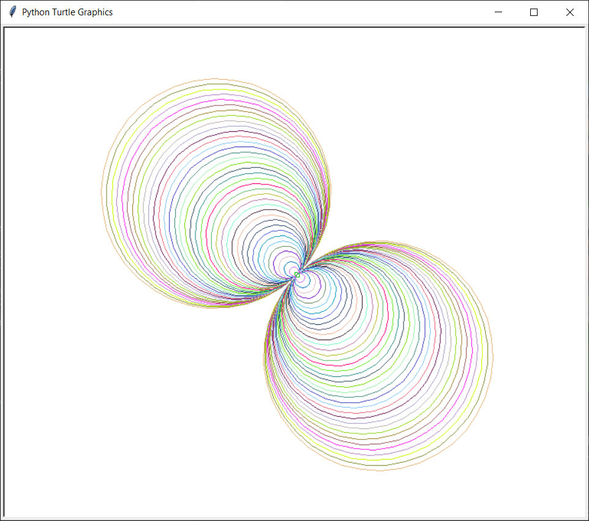
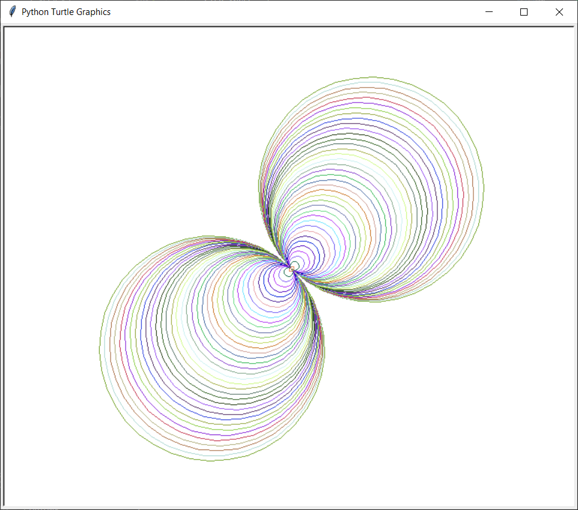
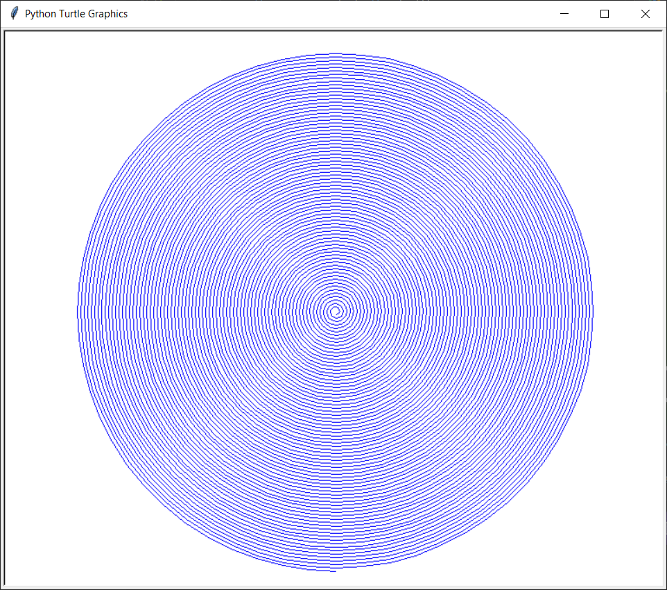
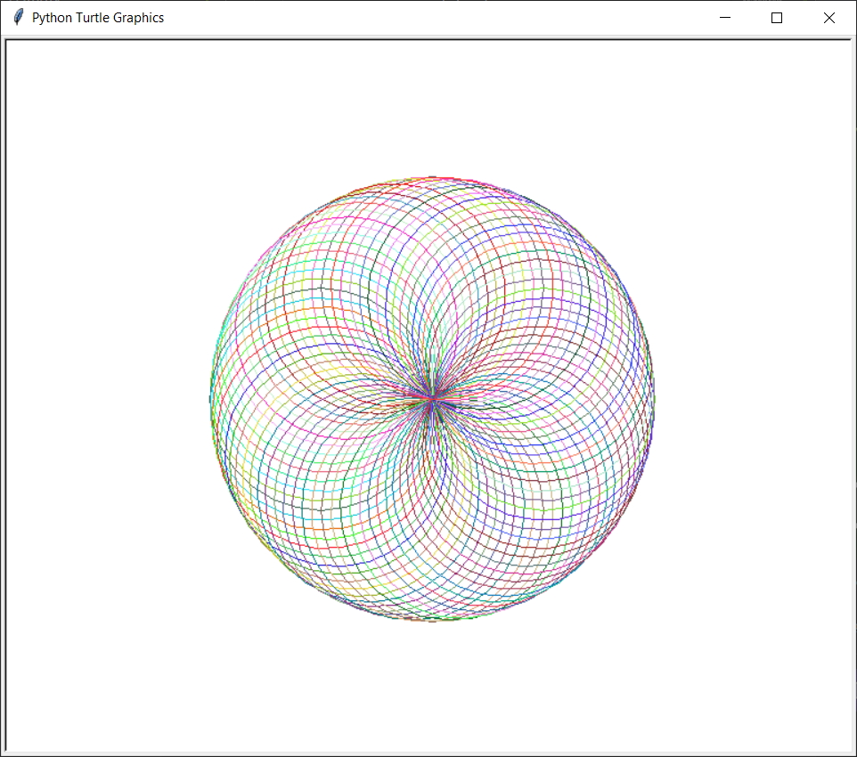
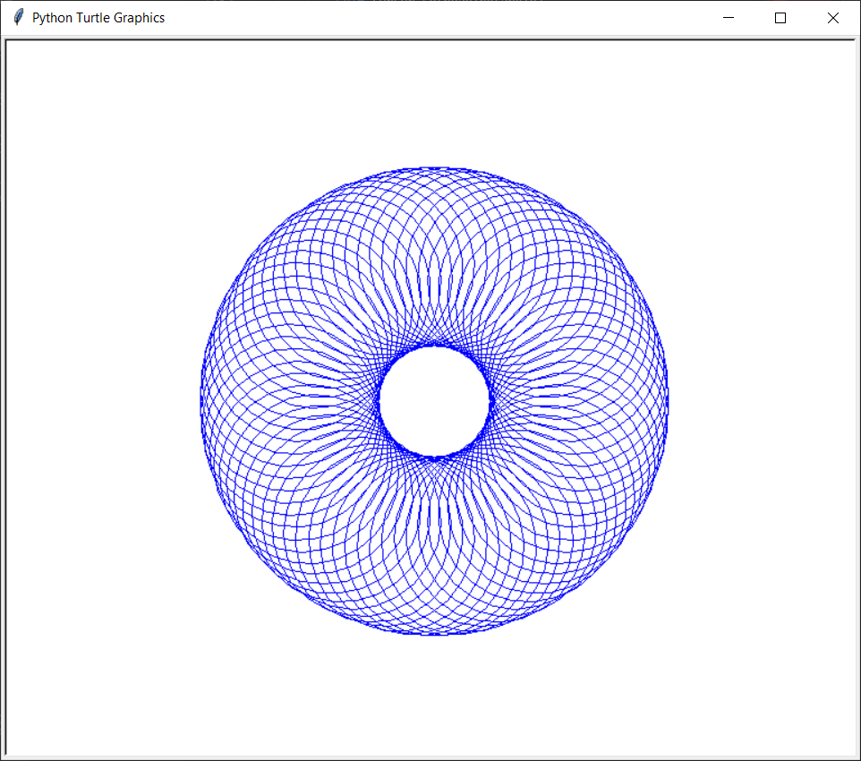

# Geometry Draw
The program draws a geometric pattern with turtle module.
There are several operating modes:
<details><summary>Lines drawing</summary>
Output example:<br>

</details>
<details><summary>Illusion 1</summary>

</details>
<details><summary>Illusion 2</summary>

</details>
<details><summary>Vertical tangent circles</summary>

</details>
<details><summary>Horizontal tangent circles</summary>

</details>
<details><summary>Diagonal tangent circles 1</summary>

</details>
<details><summary>Diagonal tangent circles 2</summary>

</details>
<details><summary>Concentric circles</summary>

</details>
<details><summary>Spiral</summary>

</details>
<details><summary>Intersection of circles</summary>

</details>
<details><summary>Circles donut</summary>

</details>
It requires several dependencies, that you can install using this bash command:
```bash
pip3 install turtle
```
or<br>
```bash
pip3 install -r requirements.txt
```
